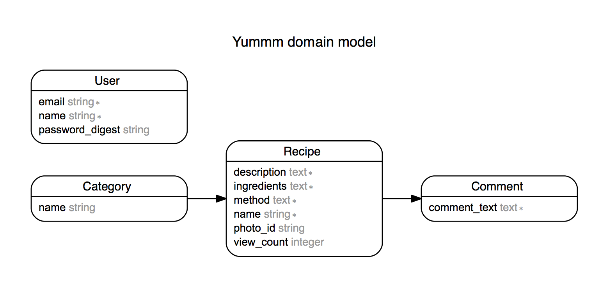

Yummm
=====

Rails Command Line Run
--------------------------

* rails generate model Recipe name:string description:text ingredients:text method:text photo_url:string
* rake db:create db:migrate db:seed
* rails generate controller recipes index show
